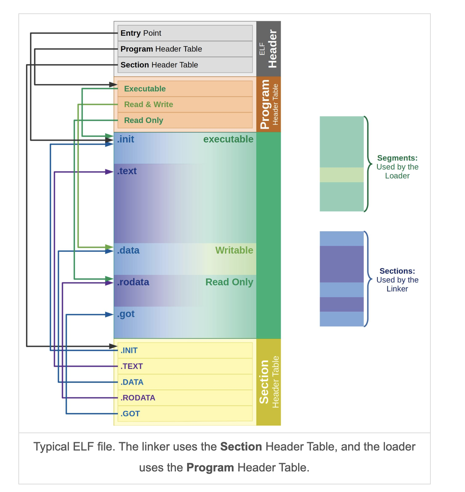
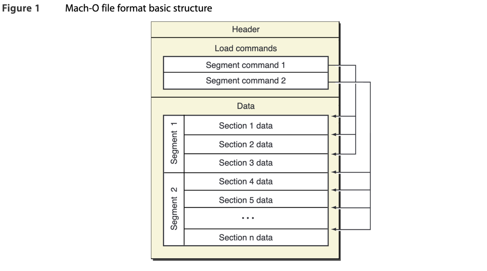

A simple toolchain (file, strings, strip, readelf, hexdump, assembler, linker, loader, disassembler) written in Rust.

## Rust toolchain demonstration

### Hexdump 
```
$ target/debug/rtool -t hexdump  -f assets/hello.o | less  
facf feed 000c 0100 0000 0000 0002 0000
0011 0000 0420 0000 0085 0020 0000 0000
0019 0000 0048 0000 5f5f 4150 4547 455a
4f52 0000 0000 0000 0000 0000 0000 0000
0000 0000 0001 0000 0000 0000 0000 0000
0000 0000 0000 0000 0000 0000 0000 0000
0000 0000 0000 0000 0019 0000 0188 0000
5f5f 4554 5458 0000 0000 0000 0000 0000
0000 0000 0001 0000 4000 0000 0000 0000
0000 0000 0000 0000 4000 0000 0000 0000 
```

### Macho tool
```
$ ./target/debug/rtool -f assets/hello.o -t macho
assets/hello.o:
match header
endianness: little
magic: 0xcffaedfe
cpu_type: 0xc001, sub_type: 0x0
file_type: 0x2000, ncmds: 0x11000, size_of_cmds: 0x20400, flag: 0x850200 
```

## Research  

### ELF file formats
* Linux ([Source](https://ics.uci.edu/~aburtsev/238P/hw/hw3-elf/hw3-elf.html#4))


* MacOS ([Source](https://github.com/aidansteele/osx-abi-macho-file-format-reference/blob/master/Mach-O_File_Format.pdf))


### Toolchain
* Object (binaries, shared libs, core dumps) files can be analyzed using `objdump` and `otool` in MacOS and `readelf` in Linux.
```
//hello.c 
#include <stdio.h>

int main() {
	printf("hello world!\n");
} 
```

* Use `clang` to generate the object file. 
```
$ clang -o hello.o hello.c 
```
* Using `gcc`.
```
$ gcc -o hello.o hello.c 
```

### ELF (Linux)

* All details:
```
$ readelf -a hello.o
```

* ELF header:
```
$ readelf -h hello.o
ELF Header:
Magic:   7f 45 4c 46 02 01 01 00 00 00 00 00 00 00 00 00
Class:                             ELF64
Data:                              2's complement, little endian
Version:                           1 (current)
OS/ABI:                            UNIX - System V
ABI Version:                       0
Type:                              EXEC (Executable file)
Machine:                           Advanced Micro Devices X86-64
Version:                           0x1
Entry point address:               0x400400
Start of program headers:          64 (bytes into file)
Start of section headers:          6320 (bytes into file)
Flags:                             0x0
Size of this header:               64 (bytes)
Size of program headers:           56 (bytes)
Number of program headers:         9
Size of section headers:           64 (bytes)
Number of section headers:         29
Section header string table index: 28
```

```
$ hexdump -n 20 hello.o 
0000000 457f 464c 0102 0001 0000 0000 0000 0000
0000010 0001 003e                              
0000014 
```

* All segments:
```
$ readelf --segments hello.o 

Elf file type is EXEC (Executable file)
Entry point 0x400400
There are 9 program headers, starting at offset 64

Program Headers:
  Type           Offset             VirtAddr           PhysAddr
                 FileSiz            MemSiz              Flags  Align
  PHDR           0x0000000000000040 0x0000000000400040 0x0000000000400040
                 0x00000000000001f8 0x00000000000001f8  R E    0x8
  INTERP         0x0000000000000238 0x0000000000400238 0x0000000000400238
                 0x000000000000001c 0x000000000000001c  R      0x1
      [Requesting program interpreter: /lib64/ld-linux-x86-64.so.2]
  LOAD           0x0000000000000000 0x0000000000400000 0x0000000000400000
                 0x0000000000000698 0x0000000000000698  R E    0x200000
  LOAD           0x0000000000000e10 0x0000000000600e10 0x0000000000600e10
                 0x0000000000000214 0x0000000000000218  RW     0x200000
  DYNAMIC        0x0000000000000e20 0x0000000000600e20 0x0000000000600e20
                 0x00000000000001d0 0x00000000000001d0  RW     0x8
  NOTE           0x0000000000000254 0x0000000000400254 0x0000000000400254
                 0x0000000000000044 0x0000000000000044  R      0x4
  GNU_EH_FRAME   0x0000000000000570 0x0000000000400570 0x0000000000400570
                 0x0000000000000034 0x0000000000000034  R      0x4
  GNU_STACK      0x0000000000000000 0x0000000000000000 0x0000000000000000
                 0x0000000000000000 0x0000000000000000  RW     0x10
  GNU_RELRO      0x0000000000000e10 0x0000000000600e10 0x0000000000600e10
                 0x00000000000001f0 0x00000000000001f0  R      0x1

 Section to Segment mapping:
  Segment Sections...
   00     
   01     .interp 
   02     .interp .note.ABI-tag .note.gnu.build-id .gnu.hash .dynsym .dynstr .gnu.version .gnu.version_r .rela.dyn .rela.plt .init .plt .text .fini .rodata .eh_frame_hdr .eh_frame 
   03     .init_array .fini_array .dynamic .got .got.plt .data .bss 
   04     .dynamic 
   05     .note.ABI-tag .note.gnu.build-id 
   06     .eh_frame_hdr 
   07     
   08     .init_array .fini_array .dynamic .got 
```

### Mach-O(MacOS)

* All details:
```
$ otool -a hello.o
hello.o:	file format mach-o arm64
Mach header
      magic cputype cpusubtype  caps    filetype ncmds sizeofcmds      flags
MH_MAGIC_64   ARM64        ALL  0x00     EXECUTE    17       1056   NOUNDEFS DYLDLINK TWOLEVEL PIE
Load command 0
      cmd LC_SEGMENT_64
  cmdsize 72
  segname __PAGEZERO
   vmaddr 0x0000000000000000
   vmsize 0x0000000100000000
  fileoff 0
 filesize 0
  maxprot ---
 initprot ---
   nsects 0
    flags (none)
Load command 1
      cmd LC_SEGMENT_64
  cmdsize 392
  segname __TEXT
```

* Header (or `objdump -p hello.o`):
``` 
$ otool -h hello.o 
hello.o:
Mach header
      magic  cputype cpusubtype  caps    filetype ncmds sizeofcmds      flags
 0xfeedfacf 16777228          0  0x00           2    17       1056 0x00200085
  
$ hexdump -n 20  hello.o 
0000000 facf feed 000c 0100 0000 0000 0002 0000
0000010 0011 0000                              
0000014 
```

* Commands with sections:
```
$ otool -l hello.o 
hello.o:
Load command 0
      cmd LC_SEGMENT_64
  cmdsize 72
  segname __PAGEZERO
   vmaddr 0x0000000000000000
   vmsize 0x0000000100000000
  fileoff 0
 filesize 0
  maxprot 0x00000000
 initprot 0x00000000
   nsects 0
    flags 0x0
Load command 1
      cmd LC_SEGMENT_64
  cmdsize 392
  segname __TEXT
   vmaddr 0x0000000100000000
   vmsize 0x0000000000004000
  fileoff 0
 filesize 16384
  maxprot 0x00000005
 initprot 0x00000005
   nsects 4
    flags 0x0
Section
  sectname __text
   segname __TEXT
      addr 0x0000000100003f7c
      size 0x0000000000000020
    offset 16252
     align 2^2 (4)
    reloff 0
    nreloc 0
     flags 0x80000400
 reserved1 0
 reserved2 0
Section
  sectname __stubs
   segname __TEXT 
... 
```

* Instruction set:
```
$ otool -tvV hello.o 
hello.o:
(__TEXT,__text) section
_main:
0000000100003f7c	stp	x29, x30, [sp, #-0x10]!
0000000100003f80	mov	x29, sp
0000000100003f84	adrp	x0, 0 ; 0x100003000
0000000100003f88	add	x0, x0, #0xfa8 ; literal pool for: "hello world!\n"
0000000100003f8c	bl	0x100003f9c ; symbol stub for: _printf
0000000100003f90	mov	w0, #0x0
0000000100003f94	ldp	x29, x30, [sp], #0x10
0000000100003f98	ret
```


## Reference materials
* [Toolchains](https://www.toolchains.net/)
* [I wrote a linker everyone can understand!](https://briancallahan.net/blog/20210609.html)
* [A ToC of the 20 part linker essay](https://lwn.net/Articles/276782/)
* [Linkers and Loaders - John R. Levine](https://www.amazon.com/Linkers-Kaufmann-Software-Engineering-Programming/dp/1558604960)

### Linux (Elf)
* [OS X ABI Mach-O File Format Reference](https://github.com/aidansteele/osx-abi-macho-file-format-reference)
* [Executable and Linkable Format (ELF)](https://www.cs.cmu.edu/afs/cs/academic/class/15213-f00/docs/elf.pdf)
* [ELF Spec](https://refspecs.linuxfoundation.org/elf/elf.pdf)
* [The ELF format](https://ics.uci.edu/~aburtsev/238P/hw/hw3-elf/hw3-elf.html)
* [ELF at OSDev](https://wiki.osdev.org/ELF)
* [Introduction to the Linux ELF file](https://www.youtube.com/watch?v=1VnnbpHDBBA&t=17s)
* [ELF in Depth](https://www.youtube.com/watch?v=nC1U1LJQL8o)
* [elf.h](https://github.com/torvalds/linux/blob/master/include/uapi/linux/elf.h)
* [ELF Format Cheatsheet](https://gist.github.com/x0nu11byt3/bcb35c3de461e5fb66173071a2379779)
      
### Mach-O(MacOS)
* [Demystify Mach-O](https://www.youtube.com/watch?v=S9FFzsF0aIA)
* [<match-o/loader.h>](https://github.com/apple/darwin-xnu/blob/main/EXTERNAL_HEADERS/mach-o/loader.h)
* [Magic Numbers, the Mach Header, and more | Inside the Mach-O Format](https://www.youtube.com/watch?v=ZMe4h2rujE0)
